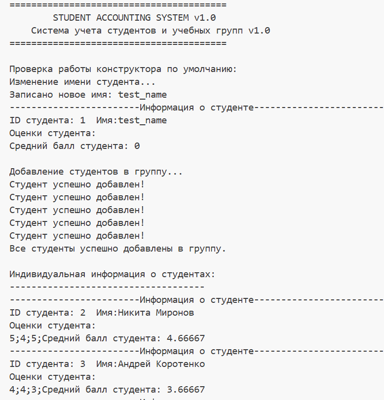
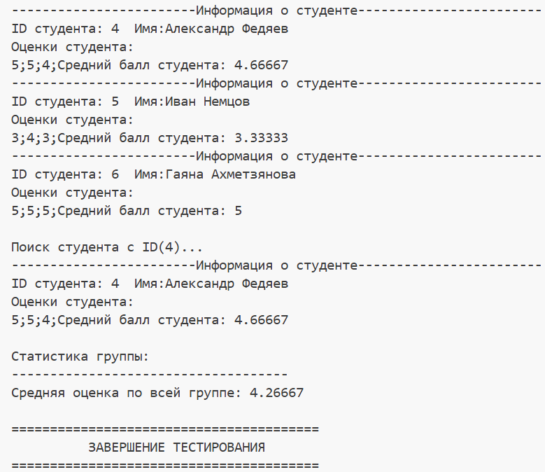

# Система учета студентов и учебных групп
## Состав команды
Архитектор (Team Lead) - Никита Миронов

Разработчик №1 - Андрей Коротенко

Разработчик № 2 - Александр Федяев

Тестировщик - Иван Немцов

Технический писатель - Гаяна Ахметзянова

## Инструкции по сборке

Команды CMake

```
cmake_minimum_required(VERSION 3.10)

project(StudentManagement VERSION 1.0 LANGUAGES CXX)

set(CMAKE_CXX_STANDARD 17)
set(CMAKE_CXX_STANDARD_REQUIRED ON)

set(SOURCES
    src/main.cpp
    src/Student.cpp
    src/StudentGroup.cpp
)

add_executable(${PROJECT_NAME} ${SOURCES})

target_include_directories(${PROJECT_NAME} PUBLIC include)

if(MSVC)
    target_compile_options(${PROJECT_NAME} PRIVATE /W4)
else()
    target_compile_options(${PROJECT_NAME} PRIVATE -Wall -Wextra)
endif()

```

## Классы и их методы

* Класс 1: Student

    - Назначение:
      
        Класс представляет отдельного студента и хранит его персональные данные и успеваемость.

    - Что содержит:
  
        ID студента

        Имя студента

        Оценки

    - Что умеет:

        Добавлять новые оценки

        Вычислять средний балл студента на основе всех его оценок

        Выводить полную информацию о студенте (ID, имя, оценки, средний балл)

    - Зачем нужен:

        Позволяет создать объект «студент», который хранит все данные об одном человеке и может самостоятельно рассчитывать свою успеваемость.

* Класс 2: StudentGroup

    - Назначение:
      
        Класс представляет учебную группу, которая объединяет нескольких студентов.

    - Что содержит:

        Название группы 

        Список студентов — коллекция объектов класса Student

    - Что умеет:

        Добавлять новых студентов в группу

        Находить студента по его ID 

        Вычислять средний балл по всей группе

    - Зачем нужен:

        Позволяет работать с группой как с единым целым — добавлять студентов, искать их, получать общую статистику по группе.

## Пример работы программы




## Проблемы и решения 


## Спасибо за внимание!
